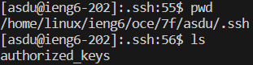

# Lab Report 2 - 25 Jan 2024
## Part 1

 
 
 

- This calls the method `handleRequest`, which contains calls to `getPath` and `getQuery` on the URL; `split` on arrays formed by the parameters of the query; and `equals` on the path string.
- The call to `handleRequest` passes in the URL `http://localhost:9001/add-message?s=hi&user=aston` as the `URI` argument. The URL path is then compared to the strings `"/"` and `"/add-message"` using the `equals` method. When the `/add-message` path is detected, the URL query is split into an array using the `split` method with `"&"` as the delimiter, to separate the message from the user. The first parameter in the query is again split with `"="` as the delimiter to store the message, and the second parameter is similarly split to save the user. The instance variable `txt`, which is to be displayed on the webpage after every request, is updated with the user and message; in this case, `"aston: hi\n"` is added to `txt`.
- The `txt` field is updated to add the user, followed by a colon and a space, followed by the message and a newline character, in this case `"aston: hi\n"`.
 
 

 
 
- The method calls for this URL are the same as those of the previous one, except that the `URI` argument is `http://localhost:9001/add-message?s=Hello&user=ak`. The `txt` field changes from `"aston: hi\n"` to `"aston: hi\nak: Hello\n"`.
- `txt` is updated to add `"ak: Hello\n"`.
 
## Part 2
 

 
The absolute path to my private key is `C:\Users\Miao0\.ssh\id_rsa`.
 

 
The absolute path to my public key is `/home/linux/ieng6/oce/7f/asdu/.ssh/authorized_keys`.
 

 
This is a screenshot of me logging in to ieng6 without a password.
