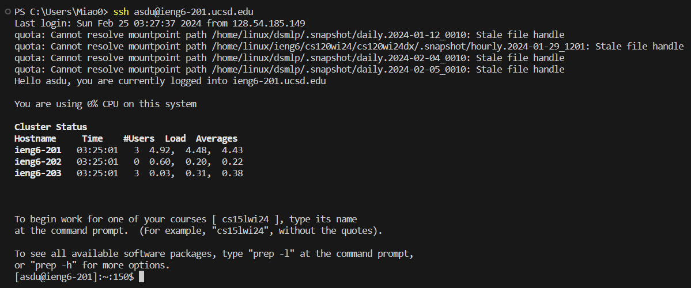
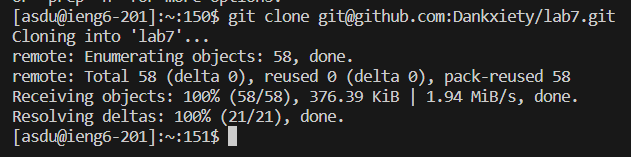
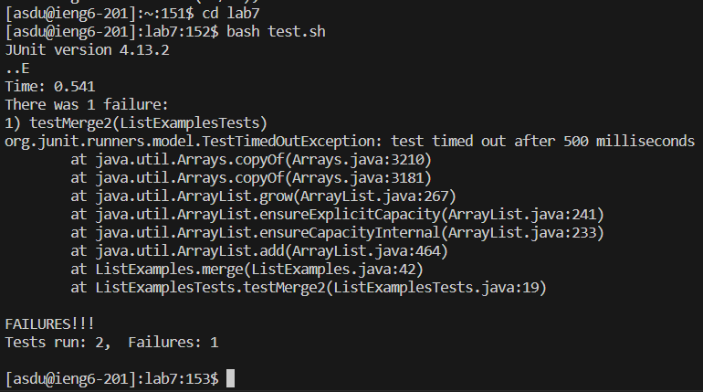
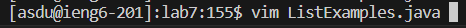
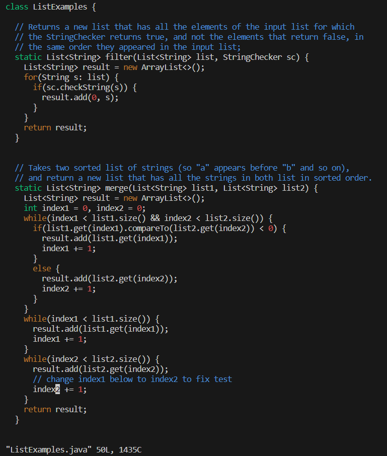
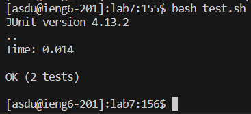
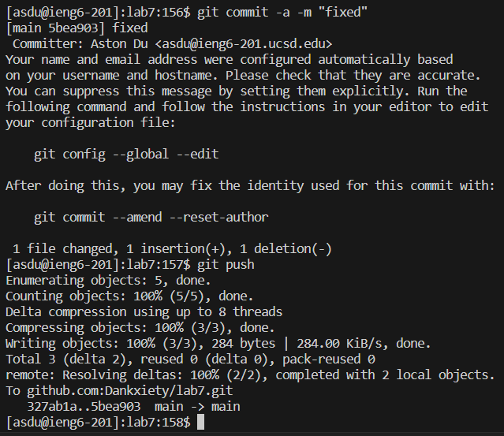

# Lab Report 4 - 22 Feb 2024
### Step 4
Keys pressed: `s` `s` `h` `<Space>` `a` `s` `d` `u` `<Shift>2` `i` `e` `n` `g` `6` `-` `2` `0` `1` `.` `u` `c` `s` `d` `.` `e` `d` `u` `<Enter>`
 

 
I used ssh to login to ieng6.
### Step 5
Keys pressed: `g` `i` `t` `<Space>` `c` `l` `o` `n` `e` `<right click at end of command line>` `<Enter>`
 

 
I used git clone to clone the forked repository. Since I had the SSH link copied, I used right click to paste it into the terminal.
### Step 6
Keys pressed: `c` `d` `<Space>` `l` `a` `b` `7` `<Enter>` `b` `a` `s` `h` `<Space>` `t` `e` `s` `t` `.` `s` `h` `<Enter>`
 

 
I used cd to enter the lab7 directory and then ran `test.sh` with bash.
### Step 7
Keys pressed: `v` `i` `m` `<Space>` `<Shift>l` `<tab>` `.` `<tab>` `<Enter>`
 

 
I used vim to open ListExamples.java. I used the `tab` functionality of VSCode to quickly navigate to the file.
 
`4` `3` `j` `e` `x` `i` `2` `<Esc>` `<Shift>;` `w` `q` `<Enter>`
 

 
I first navigated to the correct line with `43j`, which effectively repeated the `j` command 43 times. I then used `e` to navigate to the end of the current word, which put my cursor on top of the `1` in `index1`. I used `x` to delete the `1` and pressed `i` to enter insert mode. I then added `2` to the line and used `<Esc>` to return to normal mode and `:wq` to save and quit.
### Step 8
Keys pressed: `<Up>` `<Up>` `<Enter>`
 

 
Since my second most recent command ran `test.sh`, I used the up arrow key twice to quickly enter it again.
### Step 9
Keys pressed: `g` `i` `t` `<Space>` `c` `o` `m` `m` `i` `t` `<Space>` `-` `a` `<Space>` `-` `m` `<Space>` `<Shift>'` `f` `i` `x` `e` `d` `<Shift>'` `<Enter>` `g` `i` `t` `<Space>` `p` `u` `s` `h` `<Enter>`
 

 
I added my changes to a git commit with the message `"fixed"` and then pushed it.
