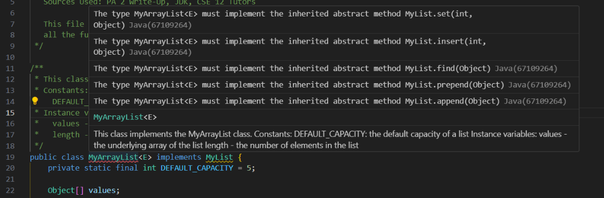

# Lab Report 5 - 7 March 2024
## Part 1 - Debugging Scenario
1. Student: I'm getting errors on all my MyArrayList methods when I try to compile the file using my bash script (see attached screenshots). It seems like I have some sort of issue with overriding methods from the MyList interface, but I'm not sure what the exact problem is.
<br />
Errors (there are more, they don't all fit in the screenshot):
<br />

<br />
Testing script:
```
javac -cp ".;..\libs\junit-4.13.2.jar;..\libs\hamcrest-2.2.jar" MyArrayListHiddenTester.java
javac -cp ".;..\libs\junit-4.13.2.jar;..\libs\hamcrest-2.2.jar" MyArrayListPublicTester.java
javac MyArrayList.java

java -cp ".;..\libs\junit-4.13.2.jar;..\libs\hamcrest-2.2.jar" org.junit.runner.JUnitCore MyArrayListHiddenTester
java -cp ".;..\libs\junit-4.13.2.jar;..\libs\hamcrest-2.2.jar" org.junit.runner.JUnitCore MyArrayListPublicTester
```
2. TA: It seems like there is an issue in your MyArrayList class. Does your environment show any errors (like red-underlined portions of your code) in that file, and if so, could you post them here?
3. Student: Here are some screenshots. There are errors in all of my methods that take a generic type variable as a parameter, but I've only included one since they all basically say the same thing.
<br />


<br />
4. File structure:
<br />

<br />
`test.sh` contents before fixing:
```
javac -cp ".;..\libs\junit-4.13.2.jar;..\libs\hamcrest-2.2.jar" MyArrayListHiddenTester.java
javac -cp ".;..\libs\junit-4.13.2.jar;..\libs\hamcrest-2.2.jar" MyArrayListPublicTester.java
javac MyArrayList.java

java -cp ".;..\libs\junit-4.13.2.jar;..\libs\hamcrest-2.2.jar" org.junit.runner.JUnitCore MyArrayListHiddenTester
java -cp ".;..\libs\junit-4.13.2.jar;..\libs\hamcrest-2.2.jar" org.junit.runner.JUnitCore MyArrayListPublicTester
```
`MyArrayList.java` contents before fixing:
```
/**
 * This class implements the MyArrayList class.
 * Constants:
 *   DEFAULT_CAPACITY: the default capacity of a list
 * Instance variables:
 *   values - the underlying array of the list
 *   length - the number of elements in the list
 */
public class MyArrayList<E> implements MyList {
	// PA code (none of this was changed to fix the error)
}
```
<br />
Command I ran to trigger the bug: `bash test.sh`
<br />
How to fix the bug: Change the class header to `[...] implements MyList<E> {` so that the `MyList` interface has a generic type.

## Part 2 - Reflection
